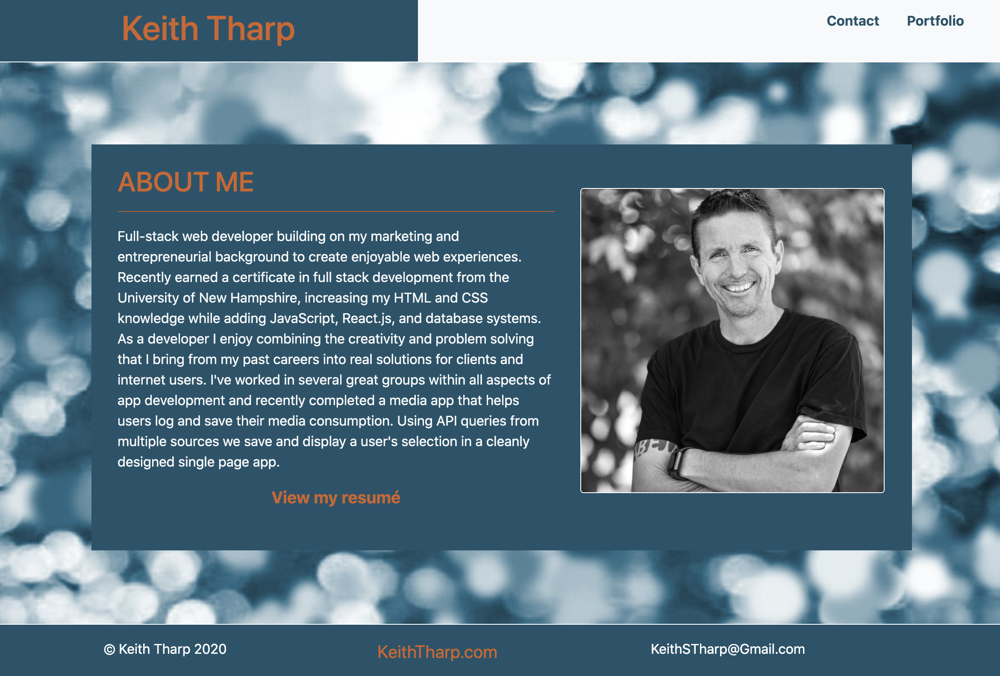

# Updated Personal Portfolio August 2020

<a href="https://keiththarp.github.io/updated-personal-portfolio-8-2020/">View live page</a>

## Details
Cleaning up the first web dev portfolio project. Adding new projects and removing additional pages.

## Technologies Used to Create SpeedQuiz
* HTML
* CSS
* JavaScript

## Early Steps

This was a tough one, writing about myself and creating a design that speaks to me was challenging. I still see this as a work in progress and am looking forward to the next iteration.

## Lessons In JavaScript

The past few apps that I've built have been single page and I like the speed and quickness of them, so I decided to shift this over to that as well.

**Swapping cards**

- I was lead to the path of swapping the display of cards for the three pages from one of my earlier projects and liked it. 

**Mobile First design**

- Using the BootStrap framework helps make the design and final product a mobile friendly app from the beginning.

## This portfolio was developed by:
- Keith Tharp
  - KeithSTharp@gmail.com
  - https://github.com/keiththarp

**Acknowledgments and Credits**

* Thanks to Scott, Mike, & Bobby for being a great and ever patient education team!
* Tons of thanks to the several different study groups that helped keep the problem solving juices flowing this week.

  
    
 

